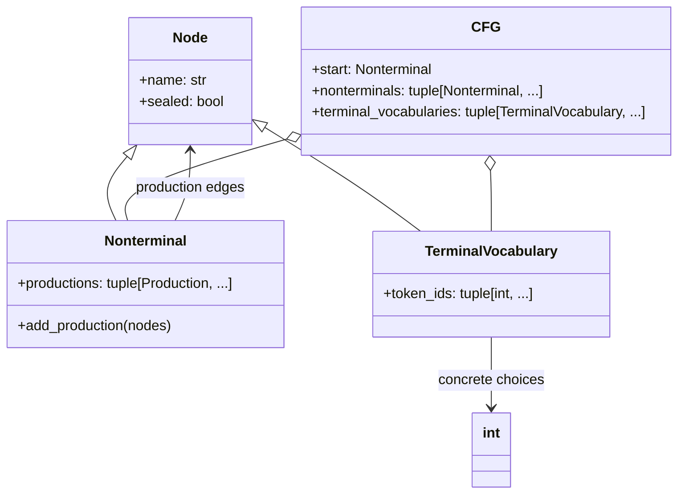
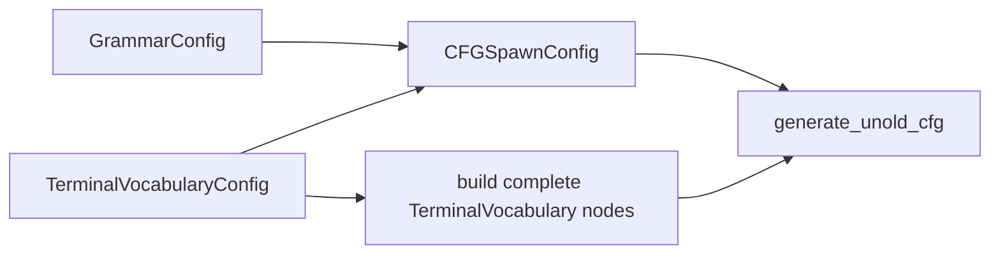
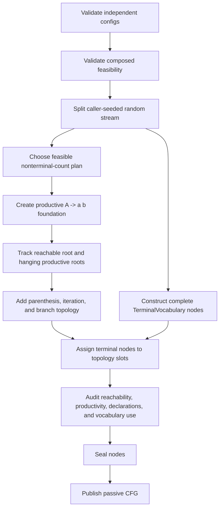

# Fixed CFG construction design

## Contract

Given one syntax configuration and one terminal-vocabulary configuration,
construct a sealed CFG whose terminal nodes already contain their concrete token
choices.

The completed graph is directly traversable:

```text
Nonterminal
  -> production
     -> Nonterminal or TerminalVocabulary
        -> concrete token IDs
```

Probability tables, epsilon state, string generation, serialization, and optimized
runtime lookup are outside this unit.

## Static graph



`TerminalVocabulary` does not mean a disjoint category. Different nodes may
contain overlapping or identical token sets, and one node may occur in many
productions. Each node receives its complete token tuple at construction. Only
`Nonterminal` has an assembly mutation because recursive graph edges are not all
known when nodes are created.

## Configuration ownership



- `GrammarConfig` owns exact rule-family counts and the nonterminal limit.
- `TerminalVocabularyConfig` owns terminal count, vocabulary size, and IDs per
  terminal.
- `CFGSpawnConfig` owns compatibility between those requests, including the
  paper's rule-capacity inequalities, the exact-use terminal-slot requirement,
  and the graph edge budget.

The grammar process consumes the completed terminal alphabet. It does not read
concrete token membership while constructing syntax.

## Module ownership

- `grammar.py` owns only the passive graph nodes and sealing lifecycle.
- `cfg_config.py` owns independent configuration and composed feasibility math.
- `terminal_vocabulary.py` constructs complete vocabulary-bearing terminals.
- `unold_rules.py` owns the paper's four rule shapes and draft semantics.
- `unold_topology.py` owns productive topology and hanging-root edge accounting.
- `unold_terminal_assignment.py` labels terminal positions and preserves exact
  rule uniqueness.
- `cfg_audit.py` independently audits the completed candidate without repair.
- `unold_cfg.py` only sequences phases, seals successful output, and publishes
  `CFG`.

No class or module owns a generic "construction" responsibility. Each owner has
one phase product or one mathematical contract.

## Construction pipeline



### Phase 1: terminal vocabularies

Input: `TerminalVocabularyConfig` and its dedicated random stream.

Output: complete `TerminalVocabulary` nodes.

Guarantees:

- every node contains exactly the requested number of distinct token IDs;
- every ID in `0..vocabulary_size-1` occurs globally;
- overlap is allowed;
- no grammar topology exists yet.

Failure occurs before any grammar node is created.

### Phase 2: feasible node-count plan

Input: `CFGSpawnConfig`.

Output: a selected total nonterminal count and a feasible initial-root interval.

The feasibility mathematics begins with equation system (10) from Unold,
Kaczmarek, and Culer, *Iterative method of generating artificial context-free
grammars*, arXiv:1911.05801. The project adds two exact-product requirements:
all supplied terminal nodes must be used, and the available nonterminal RHS edges
must connect every planned nonterminal.

The paper treats symbol counts as maxima and chooses symbol creation while adding
rules. This implementation calculates every feasible count plan first, then
randomly chooses one. That makes capacity explicit without fixing every grammar
to the minimum node count.

### Phase 3: productive foundation

Input: the selected plan and `terminal_pair_rules`.

Output: productive rule drafts of the form `A -> a b`, one or more per initial
nonterminal.

Every initial nonterminal is productive immediately. The newest initial node is
the reachable root; the others are productive but hanging.

### Phase 4: productive topology extension

Input: the foundation, remaining rule counts, and the terminal alphabet size.

Output: topology-complete drafts for `A -> a B b`, `A -> a B` / `A -> B a`, and
`A -> B C`.

Maintained invariants:

- every RHS nonterminal already denotes a productive node;
- a new LHS contains the current root on its RHS and becomes the new root;
- an existing LHS is selected only from the reachable component;
- the number of hanging roots never exceeds future child edges not reserved for
  creating new roots;
- each topology bucket retains enough terminal-label capacity to make its final
  rules unique.

This is the central correction to the rejected candidate-rescue design. The
algorithm plans node count and accounts for edges directly instead of repeatedly
constructing arbitrary rules and asking whether later rules might repair them.

### Phase 5: terminal assignment

The complete terminal nodes existed before syntax construction. Their placement
is delayed until the topology is known solely to separate two calculations:
graph connectivity and finite rule-label capacity.

Terminal assignment guarantees every `TerminalVocabulary` appears in at least one
production and selects unique terminal tuples within each topology bucket. This
staging is construction process only; the published graph has direct production
references to terminal nodes and no lexical side table.

Concrete-token sampling and syntax sampling use separate streams derived from the
caller's active PyTorch state. Changing vocabulary density therefore cannot shift
the syntax random sequence when the terminal alphabet size is unchanged.

### Phase 6: audit, seal, publish

The audit independently checks declared references, reachability, productivity,
terminal use, and concrete vocabulary coverage. It performs no repair. Failure
leaves all nodes unsealed and publishes no `CFG`.

After the audit succeeds, all nodes are sealed and the passive `CFG` is returned.
No graph-wide validation occurs during later string generation.

## Test boundaries

Committed tests separately cover:

- local node contracts;
- terminal-vocabulary coverage and overlap;
- independent and composed configuration feasibility;
- exact rule-family counts;
- terminal use and direct concrete-token access;
- syntax independence from concrete vocabulary density;
- randomized feasible nonterminal counts;
- caller-seeded reproducibility;
- productive recursion and unproductive cycles;
- failure before sealing;
- accepted small-config matrices;
- a 200-terminal, 10,000-token construction;
- iterative audit of a 2,000-node graph.
